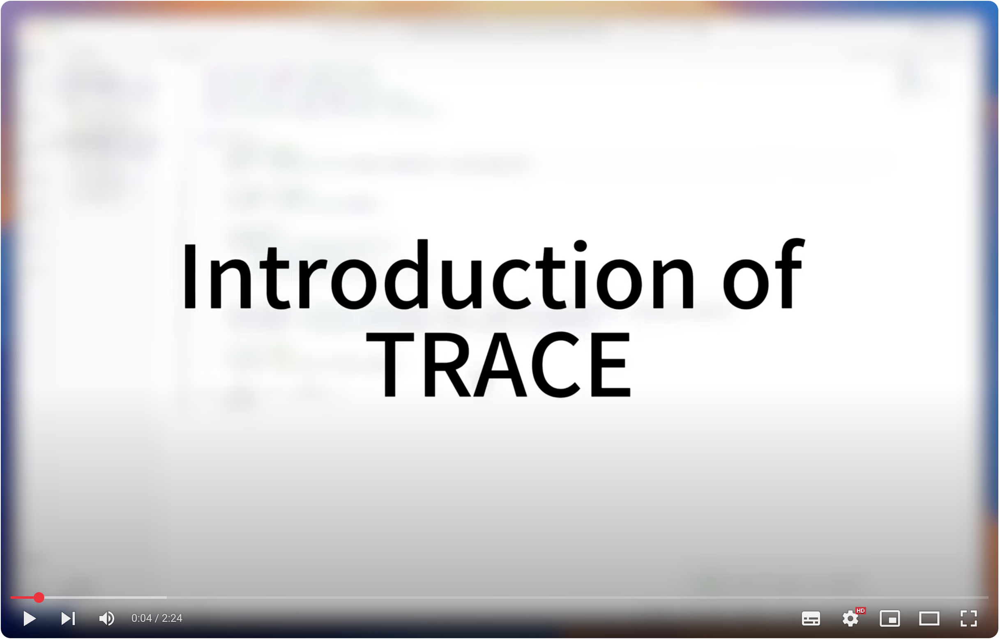

# README

## Description

This is the official repository for paper "*Learning Project-wise Subsequent Code Edits via
Interleaving Neural-based Induction and Tool-based
Deduction*" by Chenyan Liu, Yun Lin, Yuhuan Huang, Jiaxin Chang, Binhang Qi, Bo Jiang, Zhiyong Huang, and Jin Song Dong. Presented at ASE'25.

This repository contains source code, dataset, and trained model parameters of TRACE. 

## 🎥 Demonstration

> [!Note]
> * Please click the image to watch the demo video on YouTube;
> * To deploy this extension, please refer to [TRACE-extension](https://github.com/code-philia/TRACE-extension), with detailed instructions.

<div align="center">
   <a href="https://youtu.be/qfftiPzf5b4">
   
   </a>
</div>

## 📂 Contents
> More detailed READMEs are available in each sub-directory

* `/dataset_collection`: Crawl top-starred repositories' commit from GitHub
* `RQ1_locator`: The training and evaluation script for edit locator
* `RQ2_generator`: The training and evaluation script for edit generator.
* `RQ4_invoker`: The training and evaluation script for edit-composition invoker.
* `RQ5_simulation`: The evaluation script to simulation real-world editing process.

## 🚀 Getting Started
```bash
conda create -n trace python=3.10.13
conda activate trace
python -m pip install -r requirements.txt
```

## ✍️ Citation

If you find our work helpful, please consider citing our paper:

```
TBD
```