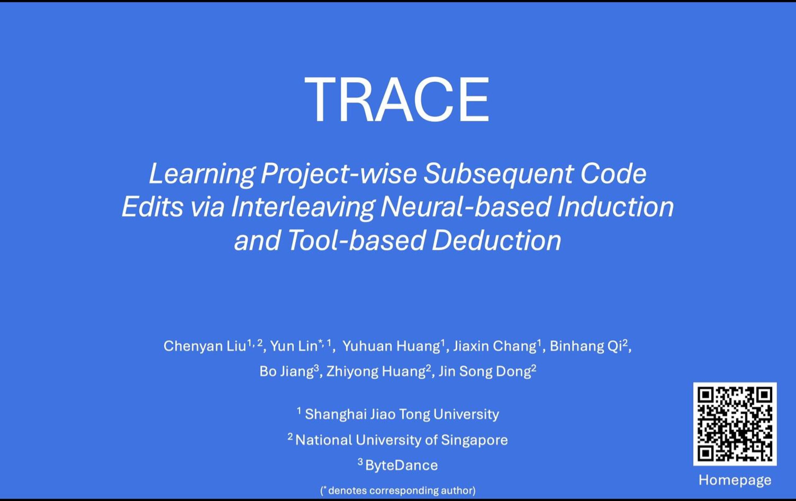

# README

This is the official repository for paper "*Learning Project-wise Subsequent Code Edits via
Interleaving Neural-based Induction and Tool-based
Deduction*" by Chenyan Liu, Yun Lin, Yuhuan Huang, Jiaxin Chang, Binhang Qi, Bo Jiang, Zhiyong Huang, and Jin Song Dong. Presented at ASE'25.

This repository contains source code, dataset, and trained model parameters of TRACE. 

## 🎥 Introduction

> [!Note]
> * Please click the image to watch the introduction video on YouTube;
> * To deploy this extension, please refer to [TRACE-extension](https://github.com/code-philia/TRACE-extension), with detailed instructions.

<div align="center">
   <a href="https://youtu.be/jCIzZilw81Y">
   
   </a>
</div>

## 📂 Contents
> [!Note]
> 
> More detailed READMEs and model downloading scripts are available in each sub-directory

* `dataset_collection/`: Crawl top-starred repositories' commit from GitHub
* `RQ1_locator/`: The training and evaluation script for edit locator
* `RQ2_generator/`: The training and evaluation script for edit generator.
* `RQ4_invoker/`: The training and evaluation script for edit-composition invoker.
* `RQ5_simulation/`: The evaluation script to simulation real-world editing process.
* `download_dataset.sh`: A script to download the TRACE dataset from HuggingFace.
* `download_treesitter.sh`: A script to download tree-sitter repositories and checkout to compatiable versions.

## 🚀 Getting Started

* Install dependencies:

   ```bash
   conda create -n trace python=3.10.13
   conda activate trace
   python -m pip install -r requirements.txt
   ```

* Download tree-sitter:

   ```bash
   bash download_treesitter.sh
   ```

* Download the dataset:

   ```bash
   bash download_dataset.sh
   ```

* Set environment variables in `.env`

   > Acquire GitHub token please refer to [Creating a personal access token](https://docs.github.com/en/authentication/keeping-your-account-and-data-secure/managing-your-personal-access-tokens#creating-a-personal-access-token-classic)

## ✍️ Citation

If you find our work helpful, please consider citing our paper:

```
@inproceedings{liu2025learning,
  title={Learning Project-wise Subsequent Code Edits via Interleaving Neural-based Induction and Tool-based Deduction},
  author={Liu, Chenyan and Lin, Yun and Huang, Yuhuan and Chang, Jiaxin and Qi, Binhang and Jiang, Bo and Huang, Zhiyong and Dong, Jin Song},
  booktitle={2025 40th IEEE/ACM International Conference on Automated Software Engineering (ASE)},
  pages={1377--1389},
  year={2025},
  organization={IEEE},
  doi={https://doi.org/10.1109/ASE63991.2025.00117}
}
```